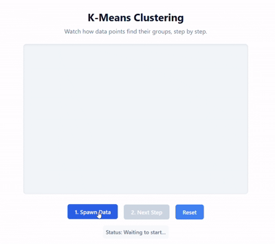

# K-Means Clustering Visualized

A lightweight, interactive web animation that explains how the K-Means clustering algorithm works. No complex math jargon, just dots finding their groups.

<div align="center">
  
</div>


## The Concept in Plain English

Machine learning often sounds like magic, but K-Means is incredibly intuitive. Imagine a large room full of people. You want to divide them into three distinct groups based on where they are standing so you know exactly where to drop off three pizzas. 

Here is how the algorithm solves this:
1. **Spawn Data:** People (the dots) are scattered randomly around the room.
2. **Drop Centroids:** You randomly place three "leaders" (the colored squares) in the room.
3. **Assign Points:** Everyone looks at the three leaders and joins the team of the leader closest to them. This forms three initial territories.
4. **Move Centroids:** The leaders then walk to the exact center of their newly formed teams.
5. **Repeat:** Because the leaders moved, some people might now find themselves closer to a different leader. Everyone recalculates and switches teams if necessary. The leaders then move to the center of the new teams.
6. **Convergence:** This back and forth repeats until the leaders stop moving. The groups are now perfectly stable. Pizza time!

## Built With

I wanted to keep this as clean and simple as possible to focus on the logic.
* HTML5 Canvas for the rendering
* Vanilla JavaScript for the algorithm
* CSS3 for the styling

## How to Run Locally

You do not need Node, npm, or any build tools to run this. It is a pure vanilla web project.

### 1. Clone the repository
```bash
git clone [https://github.com/imhammad/k-means-visualized.git](https://github.com/imhammad/k-means-visualized.git)
cd k-means-visualized
```
### Open it up

Since this project uses no external dependencies, you can simply open the index.html file directly in your web browser.

On Mac: open index.html
On Windows: start index.html
Or just drag and drop the index.html file right into an open browser tab.

Live Demo
Check out the live visualization here: [https://imhammad.github.io/k-means-visualized/]
